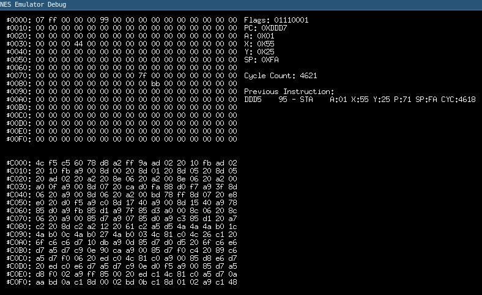

# NES emulator

Nintendo Entertainment System emulator written in Go.

### Check it out



- 6502 CPU is ~~almost~~ complete. 

- Currently working on the PPU (picture processing unit).

### Development Requirements

#### OpenGL (graphic rendering)

- To install (Ubuntu/Debian):

```bash
apt install libgl1-mesa-dev
apt install xorg-dev
```
